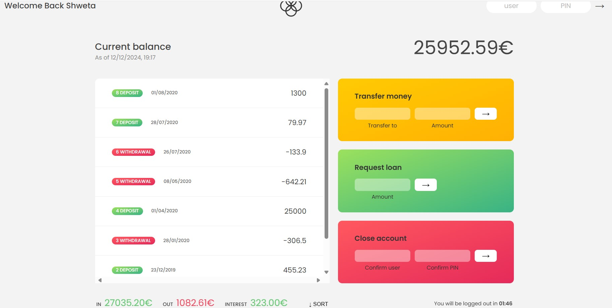

 # Bankist App

Bankist App is a modern and interactive JavaScript-based banking application. Designed as part of a learning project, it offers users the ability to manage accounts and perform core banking operations in a secure and user-friendly environment.



## Features

- **User Authentication**: Secure login system for accessing accounts.
- **Account Overview**: Detailed view of account balances, transaction history, and more.
- **Transfer Money**: Easily send funds to other users or between your own accounts.
- **Request Loan**: Apply for loans based on your transaction history.
- **Close Account**: Safely close and delete accounts when no longer needed.

## Technologies Used

The project leverages the following technologies:

- **HTML**: Structure and layout of the application.
- **CSS**: Styling and responsive design.
- **JavaScript**: Core logic and interactivity.

## Getting Started

To use the Bankist App on your local machine, follow these steps:

1. **Clone the Repository**

   ```bash
   git clone https://github.com/shwetadd33/javascript-projects.git
   ```

2. **Open the Project**
   Navigate to the project folder __/javascript-project-bankist__ and open `index.html` in your browser to launch the app.

## User Profiles

Below are pre-configured user profiles to explore the app:

| Name                  | Username | PIN  |
|-----------------------|----------|------|
| Shweta Deshmukh       | `sd`     | 1111 |
| Jessica Davis         | `jd`     | 2222 |

> **Tip**: Log in using one of the profiles above to explore all features.

## Acknowledgments

This project was inspired and developed as part of the **Jonas Schmedtmann's JavaScript Course**, providing practical experience in building functional web applications.
